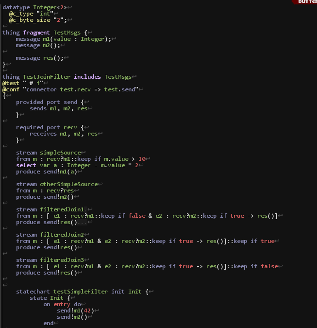

vim-ThingML
==

Vim-ThingML provides a syntax highlight and folding support for the [ThingML](http://thingml.org) language.

This is a work in progress, for now most keywords are detected but there is no region support, hence no
folding or “local” keywords.

Here is how it looks with my colorscheme:

